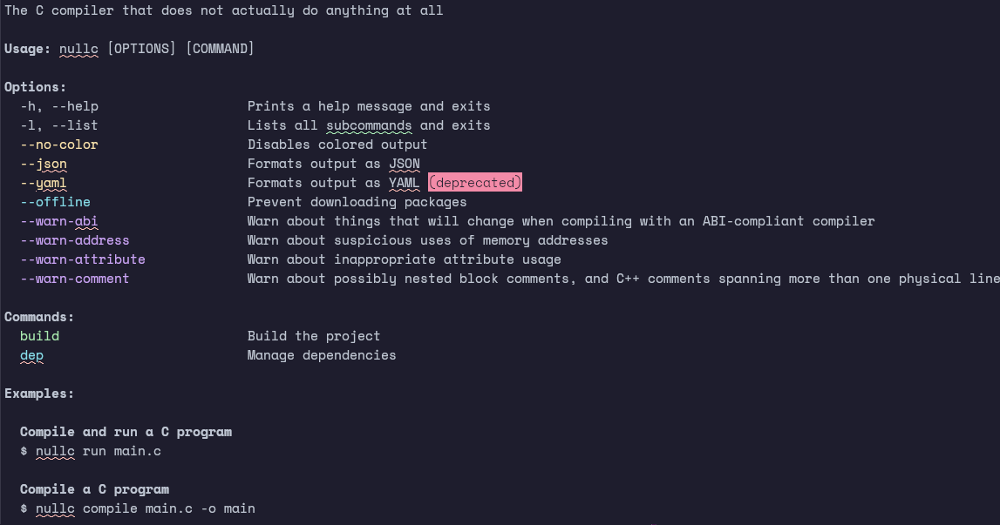

> Build powerful command-line applications in Python 🐍⚡



- 📖 [Documentation](https://phoenixr-codes.github.io/powercli)
- 💡 [Examples](https://github.com/phoenixr-codes/powercli/tree/stable/examples)
- 🖥️ [Source Code](https://github.com/phoenixr-codes/powercli)

## Features

- ✅ Simple API
- ✅ Highly configurable
- ✅ Flags, Positionals & Subcommands
- ✅ Type Hints
- ✅ Easy to test
- ✅ Well documented

## Installation

### Poetry

```console
poetry add powercli-python
```

### uv

```console
uv add powercli-python
```

### Manual Installation

Add `powercli-python` as a dependency in your `pyproject.toml` file.

```toml
dependencies = [
  "powercli-python"
]
```

## Overview

### Highly Configurable

Commands and arguments are highly configurable yet provide good defaults to work
well out of the box.

```python
import sys
from powercli import Command

cmd = Command(
    # Windows-style flag prefixes
    prefix_short=None,
    prefix_long="/",

    # use other stream
    file=sys.stderr,
)
```

### Object Oriented

Arguments are classes which can be instantiated dynamically and are not directly
bound to a parser class.

```python
from pathlib import Path
from powercli import Flag

cmd = Command()

flag = Flag(
    identifier="foo",
    short="f",
    values=[("PATH", Path)],
)
cmd.add_arg(flag)

# ... or use the shorthand ...

cmd.flag(
    identifier="foo",
    short="f",
    values=[("PATH", Path)]
)
```

### Generate man pages

```console
$ python3 -m powerdoc path/to/file.py --man
$ python3 -m powerdoc path/to/file.py --man | groff -T utf8 -man
```

### Colored output

The built-in provided flags and commands make use of colored output respecting
the user's preference.
